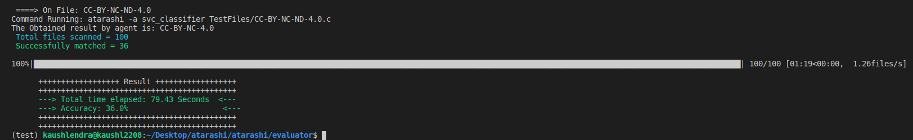
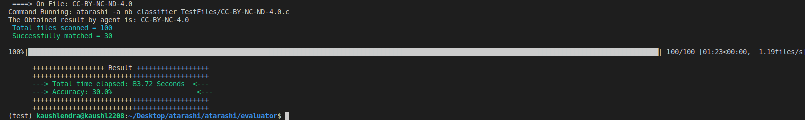

<i><h2>Refurbishing Atarashi @ <a href = "https://www.fossology.org/">FOSSology </a> </h2></i>

 
<h1 align = "center">Project Details</h1>

Atarashi scans for license statements in open source software, focusing on text statistics and information retrieval algorithms. It was designed to work stand-alone and with FOSSology Software. Atarashi is currently using text similarity algorithm based approach to give proper results. It is a well compiled piece of software with many little components(agents). Each agent has a specific form of implementation and this is the reason there is also a variety of accuracy results of the agents.

My proposed ideas and objectives revolved around Atarashi entirely i.e. from including a machine learning based approach for classification of license statements to building a completely independent library that helps Atarashi in background in extracting the license statements from the provided file or the directory. Entire goal for the proposed ideas was to introduce new functionalities into atarashi and to refurbish what it alreads has.

 

<h1 align = "center"> Contributions</h1>
<h2>1. Nirjas ~ নির্যাস </h2>

<i>A Python library for Comments and Source Code Extraction</i>

- Codebase: [GitHub](https://github.com/fossology/Nirjas)
- Library: [PyPI](https://pypi.org/project/Nirjas/)
- Documentation: [Nirjas-Wiki](https://github.com/fossology/Nirjas/wiki)

One thing about source codes is very special that every code contains a lot of vital information that includes the license which tells about the re-usability and implementation tactics for the code. Extracting the license part from the code blocks of the file was the crucial and proposed working for Nirjas. Atarashi and all the agents in it has high dependency on quality of input they are getting from this "Code Comment Extractor". Better inputs results into higher accuracy for the models.

From there, I and [Ayush](https://github.com/hastagAB) decided to go for a fully functional library which can be used for other purposes as well. We started working on it from ground zero. We discussed and prepared a working structure and we followed it till the library is able to accomplish the defined task.

Nirjas is live at [PyPI](https://pypi.org/project/Nirjas/) and can be installed using `pip install nirjas`.

The major task was to classify different types of comments and to write separate logic for each one of them. The types are:

Extraction of comments is a very crucial task as each language can have different commenting styles and several types of comments as well. We had to come up with a logic for each comment type. They are:

1. Single line comments
2. Multi-line comments
3. Continuous single lines (continuous lines commented out using single-line syntax at each line)
4. Inline comments (the comments that are written after the code on the same line)

We made *Nirjas*  user-friendly and multi-purpose. It not only extracts the comments from the inputfile but also it can provide you a source file with the source code. Also, it includes some metadata that really helps in understanding the dynamics of the code. It supports a large variety of [programming languages](https://github.com/fossology/ninirjas#supported-languages) and this is not the end, Nirjas is designed in such a way that adding new languages is super simple.

  

### Pull Request & Commits Authored:
- [UnitTest & Automated TestScript](https://github.com/fossology/Nirjas/pull/3) (PR)
- [Seprate functions for seprate functionalities](https://github.com/fossology/Nirjas/pull/8/commits/cf942174b342e395cef25dfadf123ff9dea68b7a)(commit)
- [Add testing support for new functions](https://github.com/fossology/Nirjas/pull/8/commits/8818e80727e359c020443dd01086a71e3c5c7f48)(commit)
- [Add regular expressions for particular comment type](https://github.com/fossology/Nirjas/pull/2/commits/7897c13446671cd37854894df5690601f4540614)(commit)
- [Regex update of all the comment types](https://github.com/fossology/Nirjas/pull/2/commits/e8a2750d2de9389903f4e7317bc13b545425584a)(commit)
- [Integration of all the files with binder](https://github.com/fossology/Nirjas/pull/2/commits/6acc691a11f257723a23a93893bc10612b0a92c7)(commit)
- [Directory traversing & Add flags for command line](https://github.com/fossology/Nirjas/pull/2/commits/ac0ff0144c355424016deaabd4945eead22d6771)(commit)
- [Add Command Line Input for file to scan](https://github.com/fossology/Nirjas/pull/1/commits/e54deabddfbe64a9ee5bcbc28a5cc398fa6f1fed)(commit)

<h2>2. Introducing machine learning classifiers for License Detection </h2>

Currently, Atarashi works on algorithms like tfidf, ngram, DLD etc. These algorithms are supported by different types of similarity calculation techniques like Cosine Similarity, Score Similarity etc. We planned to introduce a RNN model for this specific task and the basics of model will use Siamese Manhattan approach. Licenses are bit tricky and uncertain in nature this made us to question this approach. We planned to introduce few machine learning based classification approaches and check how they behave on licenses and after going through these results we can plan for RNN approach.

I started working on 4 different approaches/models to solve this problem. I picked some good classification models and trained them on the dataset provided. Pre-processing of license text and maintaining a dictionary of vocabulary for each licenses helped a lot in classification. We finally came up with three models. The main target was to achieve a good accuracy score with minimization of time required. The models introduced finally are:

- [Logistic Regression](https://scikit-learn.org/stable/modules/generated/sklearn.linear_model.LogisticRegression.html)
-  [Multinomial Naive Bayes](https://scikit-learn.org/stable/modules/generated/sklearn.naive_bayes.MultinomialNB.html?highlight=multinomial%20naive%20bayes#sklearn.naive_bayes.MultinomialNB)
- [Linear SVC](https://scikit-learn.org/stable/modules/generated/sklearn.svm.LinearSVC.html?highlight=linear%20svc#sklearn.svm.LinearSVC)

<h2>Results</h2>

The accuracy of the models is calculated through the [evaluator script](https://github.com/fossology/atarashi/blob/master/atarashi/evaluator/evaluator.py) on pre-compiled [testing dataset](https://github.com/fossology/atarashi/tree/master/atarashi/evaluator).

| *Model Name*  | *Accuracy Score in %*   | *Time taken on 100 files in (sec)*   |   
|---|---|---|
|  *Logistic Regression* | 31  | 88.6   |   
| *Linear SVC*  | 36  | 79.4  |   
|  *Multinomial Naive Bayes* | 30  | 83.72  |  

- **Screenshots of results**

    1. *Linear SVC*

    

    2. *Logistic Regression*

    

    3. *Multinomial Naive Bayes*

    

### Pull Request 
- [Feat(models): Implemented three models for license similarity](https://github.com/fossology/atarashi/pull/69)

<h2>3. SPDX Dataset Generation </h2>

 Dataset is a key component for working of any Machine Learning or the Deep Learning models. The dataset defines the accuracy of any model i.e. Lack of properly arranged and described data leads to lower accuracy(mostly). We are curently using this [licenseList.csv](https://github.com/fossology/atarashi/blob/master/atarashi/data/licenses/licenseList.csv) as our main dataset for classification.

 The only backstep with our current data is that it belongs to `1-Class -- 1-License Text` category and the most likeable data for the model to train properly should be of `1-Class -- N-License Text`. Reason being the license text in source code are unpredictable and the model should be flexible and trained on variety of probable and most occuring form of that specific class. After searching a lot for getting any similar dataset we decided to create one for ourselves.

- ### What approach we took?
    This task was also a combined implementation by me and [Ayush](https://github.com/hastagAB). The perfect way of dividing a single file's paragraphs into several files was by N-gramming it. Then after applying a bit of logic and getting all the permutations and combinations with the N-grammed files we achieved a somewhat closer result. 
    E.g. 

    Suppose a license text has 5 paragraphs [1,2,3,4,5] in order. To create a dataset we include subsets like [1], [1,2], [1,2,3], [1,2,3,4], [1,2,3,4,5] for all combinations starting from 1,2,3,4 and 5. each one with the same label.

    We generated about *1 million files using 447 license files*. ***Voilaa !!***

- ### What else is needed to be done?

    After looking at 1 million files the first thought that came into our mind was of "How many of it is relevant and what is the frequency of noise in it?". Yes, the dataset now needed chopping off and in other words normalization on the basis of relevance.
    
    Few more things that needed to be done are:

    - Shifting from txt files to SPDX JSON endpoint
    - Differentiating License Header from Full Text
    - Adding FOSSology Nomos agent [STRINGS.in](https://github.com/fossology/fossology/blob/master/src/nomos/agent/STRINGS.in) regex in dataset creation

- ### Codebase

    - GitHub Repo: [SPDX OSS Dataset](https://github.com/hastagAB/SPDX-OSS-Dataset)
    - Pull Request: [Adding Permutations and optimising the code](https://github.com/hastagAB/SPDX-OSS-Dataset/pull/1)

 
<h1 align="center"> Deliverables </h1>

| Tasks   | Planned | Completed     | Remarks    |
| :---:       |    :----:   |    :---:      |    :---:      |
| Creating Nirjas     | Yes       | :heavy_check_mark: | Beta version is live & the project will be developed & maintained continuously |
| Implementing Classification Algorithm     | Yes       | :heavy_check_mark: | The current accuracy and speed is acceptable but the new dataset might help increasing frequency |
| SPDX Dataset Generation    | Yes       | :heavy_check_mark: | Generations is completed but it requires cleaning.  |
| Shifting from Argparse to Plac     | Yes       | :x: | It is in the queue for now.  |

 
<h1 align="center"> Future Goals  </h1>

1. Nirjas still needs implementation of a fully round up comment extraction approach.
2. Continue cleaning of new SPDX dataset and figuring out other corner cases. 
3. Continue developing Nirjas and Atarashi
4. Implementing the classification models on the new dataset and working on achieving higher accuracies.
5. Developing a high accuracy algorithm and then Integrating Atarashi with Fossology.
6. Maintaining Nirjas and Atarashi

  
<h1 align="center"> Key Takeaways </h1>

- Learnt the art of collaboration and working on real-time software development.
- Improved programming skills, including OOP concepts and Modular Programming.
- Learnt alot about Text Similarity algorithms, NLP Techniques and Classification approaches.
- Learnt about importance of Open-Source licenses and their detail figurative analysis.
- Learnt about Python Packaging.
- Improved Git skills.
- Importance of CI/CD and Unit Tests.
- Better analysis of code and debugging more easily.
- Importance of a well equipped dataset and creating one from scratch.
- Punctuality and adaptability according to time and situation.
- Communicating properly, presenting the code and keep on asking doubts.

# Reach out to me
- [Connect with me on LinkedIn](https://www.linkedin.com/in/hastagab/)
- [Give a follow on GitHub](https://github.com/kaushl2208) 
- [Follow me at Twitter](https://twitter.com/Kaushl2208)
- [Email](kaushlendrapratap.9837@gmail.com)